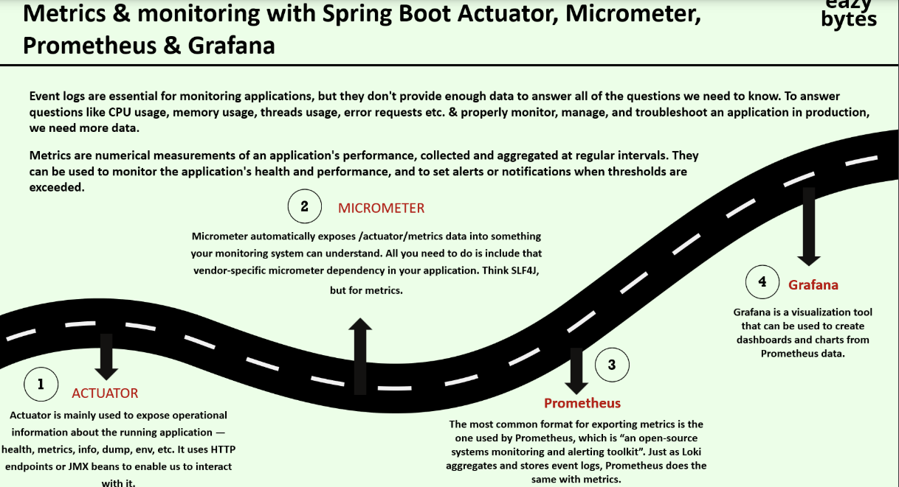
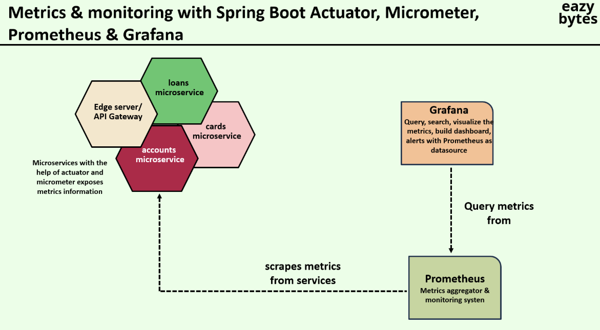

# Logging and Monitoring

Info
-----------------------
1. Logging and Monitoring is taken by different team called platform,operations or devops
2. Logging and monitoring is achieved using third party tools
3. Grafana - Log Aggregation
4. Metrics
   5. Spring Boot Actuator
   6. MicroMeter
   6. prometheus.io
7. Sending Alerts
   8. Grafana
8. Distributed Tracing
   9. Spring Cloud Sleuth - OutDated
   10. OpenTelemetry
   11. Tempo
   12. Grafana

